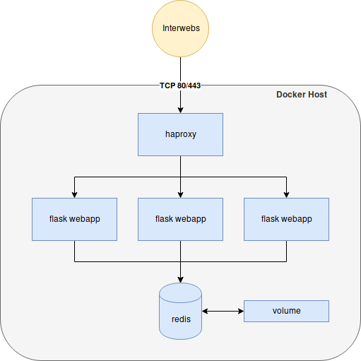

% Dockerfile Hands-On
% Lukas Grossar
% September 30, 2016


Be smart. Think open source.

# Docker-Compose Hands-On

## Your first compose file

Use what you learned until now to write your first compose file

* Create a simple flask application from source 
* Scale it to 3 replicas
* The webapp containers should be served by an haproxy
* The webapp containers should be linked to a redis container

## Architecture design



## Important informations

* **haproxy**: take the `adfinissygroup/haproxy` image
* **webapp**: you can find the source code in the next slide
* **redis**: take the official `redis` image
* **redis volume**: map a directory in your home to /data

## Web app source code


./app.py

```
#!/usr/bin/env python

from flask import Flask
import socket,redis,os

r=redis.Redis(host=os.getenv("REDIS_PORT_6379_TCP_ADDR"),port=os.getenv("REDIS_PORT_6379_TCP_PORT"))
r.set("count",0)

app = Flask(__name__)

@app.route("/")
def index():
  r.incr("count")
    return "Visit number %d\nHostname: %s\n" % (int(r.get("count")),socket.gethostname())

if __name__ == "__main__" :
  app.run(host="0.0.0.0")
```

## Web app Dockerfile


./Dockerfile
```
FROM python
RUN pip install flask redis
WORKDIR /
COPY app.py /
EXPOSE 5000
CMD python app.py
```

---


## Feel Free to Contact Us

[www.adfinis-sygroup.ch](https://www.adfinis-sygroup.ch)

[Tech Blog](https://www.adfinis-sygroup.ch/blog)

[GitHub](https://github.com/adfinis-sygroup)

<info@adfinis-sygroup.ch>

[Twitter](https://twitter.com/adfinissygroup)
