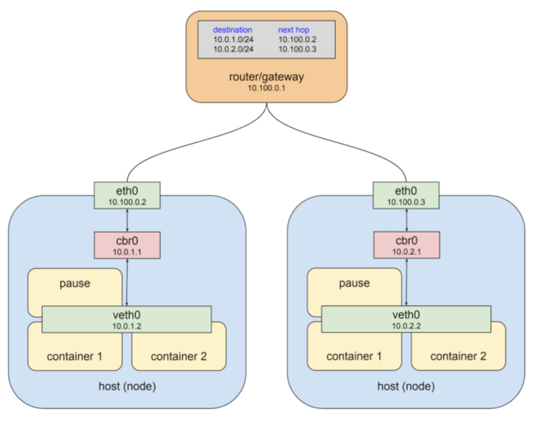

% Kubernetes Networking
% Lukas Grossar


Be smart. Think open source.

---

## Kubernetes Networking

Introduction to the networking layers in Kubernetes

---

## Kubernetes Networking Layers


## Kubernetes Networking Layers

* Host network
* Overlay/CNI network
* Service network

## Host network

* Standard network interfaces configured on the host
* Used for external communication
* Not managed by Kubernetes

## Overlay/CNI network

* Flat virtual network via CNI plugins (e.g. Flannel)
* Used for Pod-Pod communication
* Split into smaller subnets per host (/23)
* Every pod receives an IP within the host subnet

##


## Service network

* Virtual IP addresses for internal services (ClusterIP)
* Not attached to any interfaces
* Managed by `kube-proxy`
* Visible in `iptables` configuration

## Network flow



## Network flow for ClusterIP


---

## External Access

How to enable external access to your services?

## Kubernetes Services

Two types of services allow external access

* NodePort
* LoadBalancer

## NodePort

* Expose a service on a defined port
* Port is exposed on **every** node of the cluster
* Might be used as backend for an external loadbalancer

## LoadBalancer

* Requests an external loadbalancer
* Mostly relevant for cloud environments

## Ingressᵝ API

* Requires deployment of an Ingress controller
* API covers functionality of L7 loadbalancer
* TLS possible via Secrets API

## Ingress examples

```yaml
apiVersion: extensions/v1beta1
kind: Ingress
metadata:
  name: vhost-ingress
spec:
  rules:
  - host: first.example.com
    http:
      paths:
      - backend:
          serviceName: service1
          servicePort: 80
```

## Ingress examples

```yaml
apiVersion: extensions/v1beta1
kind: Ingress
metadata:
  name: url-split-example
  annotations:
    nginx.ingress.kubernetes.io/rewrite-target: /
spec:
  rules:
  - host: second.example.com
    http:
      paths:
      - path: /api
        backend:
          serviceName: service1
          servicePort: 4200
      - path: /frontend
        backend:
          serviceName: service2
          servicePort: 8080
```

---

# Attribution / License

* Kubernetes Networking Graphics by [Mark Betz](https://medium.com/google-cloud/understanding-kubernetes-networking-pods-7117dd28727)

* Slides
Adfinis SyGroup AG, 2017, Attribution-NonCommercial 2.0
(CC BY-NC 2.0)

---

## Feel Free to Contact Us

[www.adfinis-sygroup.ch](https://www.adfinis-sygroup.ch)

[Tech Blog](https://www.adfinis-sygroup.ch/blog)

[GitHub](https://github.com/adfinis-sygroup)

<info@adfinis-sygroup.ch>

[Twitter](https://twitter.com/adfinissygroup)
