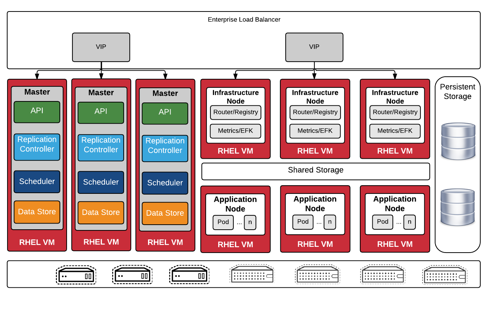

% Kubernetes Basics
% Lukas Grossar

# What is OpenShift?

Container Orchestration and Platform as a Service Solution

Automates the deployment and management of containers

# Why OpenShift?

* Based on Kubernetes
  * Fastest growing community
  * One of the top GitHub projects
* Basically an K8S distribution with more features
* Proven install path and supported by RedHat
* Has Platform as a Service features


# Why container orchestration?

* Managing applications is hard
* Packaging applications is even harder
* Deploying applications is cumbersome

**Automation is key!**

---

## What does OpenShift offer?

* Pods based on immutable Docker images
* Deployments managing application updates
* Application Lifecycle managment
* Persistent Storage
* DNS Resolution for Services
* Secret Management
* Config Management
* Container Registry

**All of this via a "simple" REST API!**

## What is k8s handling for us?

* Scheduling ✔
* Networking ✔
* Storage ✔
* Rolling Update ✔
* Docker Images ✔
* Autoscaling ✔


# OpenShift Architecture

---



# OpenShift Terminology

---

## Pods and Container

Pod is the smallest unit in OpenShift & Kubernetes

* Pod can consist of multiple containers
* All containers of a pod run on the same node
* Containers in a pod can communicate via localhost
* Containers in a pod share a kernel namespace

## Service

Services abstract access to Pods

* Selection of Pods via Labels
* Typically only cluster internal access

```yaml
kind: Service
apiVersion: v1
metadata:
  name: "example-service-prod"
spec:
  selector:
    app: "example-app"
    env: "production"
  ports:
    - protocol: "TCP"
      port: 80
      targetPort: 8080
```

## Routes

Ingress allows external access to Services

* Hostname
* URL
* HTTPS possible

```yaml
apiVersion: v1
kind: Route
metadata:
  name: example-route-prod
spec:
  host: www.example.com
  to:
    kind: Service
    name: example-service-prod
```

## Deployment

Manages a set of Pods

* De facto standard for deploying applications
* Manages multiple iterations of an application
* Creates a ReplicaSets for each release
* Allows rollback to a previous release when desired
* Automatic deployment via triggers

OpenShift also has DeploymentConfigs which are discouraged to use
by 2019.


## Persistent Volume Claim

Requests for persistent Storage

* Automatic provisioning in some Providers (eg. Azure, AWS, NetApp)
* Different requirements via StorageClass


## Builds

Transform input parameters or source code into a runnable image

Possible sources:
* Image, Source, Binary, ...
* Builds are written in Image Stream


## Images & ImageStreams

Abstraction of Docker Images in OpenShift

* different sources via one API


## Projects

Separation of consumers/environments

* Resource Quotas
* All resources are attached to a namespace
* RBAC makes sharing of namespaces possible (with some NetworkPlugins)


# Common CLI commands

---

## oc

* CLI for **everything**
* Short for OpenShift control

## oc create

Create resources in Kubernetes

* Definition in YAML or JSON
* Validation in `oc` client

```
oc create -f pod.yaml
oc create -f http://example.com/pod.yaml
cat pod.yaml | oc create -f -
oc create -R -f dir/
```


## oc get

List OpenShift resources

* Different output formats
* Filtering via labels possible

```bash
oc get all
oc get pods
oc get dc
oc get pods -o wide
oc get all -l env=production
oc get po/nodejs-ex -o yaml
```

## oc edit

Edit resource definitions

* Validation in `oc` client
* Suitable for debugging

```bash
oc edit dc/nodejs-ex
```

## oc delete

Deletion of resources

```bash
oc delete rc/nodejs-ex
```


## oc adm

Administrative OpenShift tasks

* Manage cluster nodes
* Manage Permissions
* Manage Groups/User
